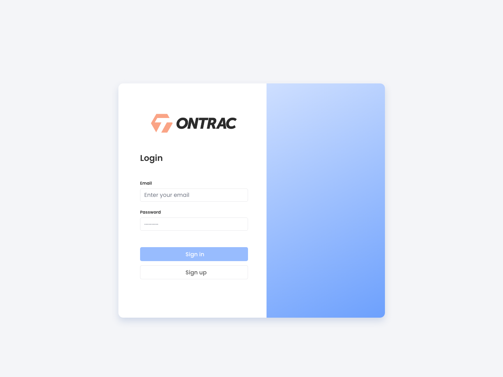

# Ontrac 
--
### Overview

Ontrac is a web app used to track and create workouts and exercises. This app is build using React, JavaScript, CSS, Node, MySQL. 

 

## Project Status
Currently, this project is still under development. Users can currently make an account/log in, create exercises and workouts. Chart creation and form validation is still being worked on. Be sure to checkout the `dev` branch to see current works on project

 

## Installation and Setup Instructions

Clone down this repository. You will need `node` and `npm` installed globally on your machine.  

Installation:

1. cd into `ontrac` directory
2. run `npm install`
3. run `npm install-all-deps`

Start: 

1. `npm start`

To Visit App:

`localhost:3000/login` 

  

## Project Screen Shot

